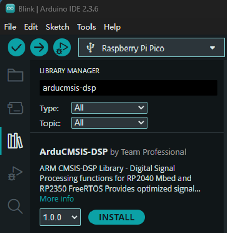

# A CMSIS-DSP library for Arduino supporting Raspberry Pi Pico/Pico2 (RP2040/RP2350)
## CMSIS-DSP Arduino Library

This is a precompiled Arduino library package for ARM CMSIS-DSP (Cortex Microcontroller Software Interface Standard - Digital Signal Processing Library) maintained by teamprof.net@gmail.com


CMSIS-DSP empowers embedded developers to deliver high-performance signal processing solutions with less effort, greater reliability, and optimized use of Arm Cortex-M hardware. It’s the go-to library for applications ranging from audio processing to IoT sensor analytics.

<a href="https://www.buymeacoffee.com/teamprof" target="_blank"></a>


## Introduction
The CMSIS-DSP library, part of Arm’s Cortex Microcontroller Software Interface Standard (CMSIS), provides a powerful and efficient set of digital signal processing (DSP) functions tailored for embedded systems. Leveraging this library offers several key benefits:
### 🚀 Performance Optimized
- Functions are hand-tuned for Arm Cortex-M processors, ensuring maximum efficiency.
- Exploits hardware features such as SIMD instructions to accelerate DSP workloads.
### 📦 Comprehensive Function Set
- Includes a wide range of DSP operations: filtering, transforms (FFT, DCT), matrix math, statistics, and interpolation.
- Provides ready-to-use building blocks for audio, sensor fusion, and control applications.
### ⚡ Reduced Development Effort
- Eliminates the need to write and optimize low-level DSP routines from scratch.
- Offers consistent APIs across Cortex-M devices, simplifying portability and scalability.
### 🔧 Reliability and Maintainability
- Developed and maintained by Arm, ensuring robustness and correctness.
- Widely adopted in industry, backed by extensive testing and community support.
### 🌍 Ecosystem Integration
- Seamlessly integrates with other CMSIS components (RTOS, drivers, middleware).
- Compatible with popular toolchains and IDEs, making it easier to adopt in existing workflows.

## ⚠️ Challenges with Arduino Integration
While CMSIS-DSP is highly optimized for Arm Cortex-M devices, integrating it into the Arduino ecosystem can be challenging. Arduino’s abstraction layers and simplified build system are not designed to expose low-level CMSIS components directly. Developers often face issues such as:
- Manual configuration of include paths and compiler flags to access CMSIS headers.
- Limited compatibility with Arduino’s library manager, requiring custom setup or external build scripts.
- Portability concerns, since Arduino sketches are expected to run across diverse boards, but CMSIS-DSP is tightly coupled to Arm-based MCUs.
- Debugging complexity, as mixing Arduino’s runtime with CMSIS-DSP often demands deeper knowledge of toolchains and linker scripts.
For teams accustomed to Arduino’s plug-and-play simplicity, this integration effort can feel steep. However, once properly configured, CMSIS-DSP unlocks performance levels far beyond what Arduino’s built-in math libraries can provide.

## 🚫 RP2040 Limitation in Arduino_CMSIS-DSP
It’s important to note that the Arduino_CMSIS-DSP library, which provides a packaged version of CMSIS-DSP for Arduino users, does not currently support the RP2040 microcontroller. This is a significant limitation for developers working with Raspberry Pi Pico or other RP2040-based boards, as they cannot directly leverage CMSIS-DSP through Arduino’s library manager. Instead, developers must resort to manual integration or alternative DSP libraries, which increases setup complexity and reduces the out-of-the-box convenience that Arduino typically offers.

## ✅ ArduCMSIS-DSP: Expanded Support for RP2040 and RP2350
A promising development is the introduction of the ArduCMSIS-DSP library, which extends CMSIS-DSP functionality to both RP2040 and the newer RP2350 microcontrollers. This advancement bridges the gap for Raspberry Pi Pico users and developers targeting RP2350-based boards, enabling them to access optimized DSP routines directly within the Arduino ecosystem. With this support, developers can now combine Arduino’s ease of use with the performance benefits of CMSIS-DSP, reducing integration friction and opening the door to more advanced audio, signal processing, and IoT applications on these popular platforms.


| Feature / Aspect            | Arduino_CMSIS-DSP                          | ArduCMSIS-DSP (New)                         |
|-----------------------------|--------------------------------------------|---------------------------------------------|
| **Supported MCUs**          | Arm Cortex-M based boards (limited set)    | RP2040 (Raspberry Pi Pico) and RP2350, plus broader Cortex-M support |
| **RP2040 Support**          | ❌ Not supported                           | ✅ Fully supported                          |
| **RP2350 Support**          | ❌ Not supported                           | ✅ Fully supported                          |
| **Integration with Arduino**| Packaged as an Arduino library, but limited board coverage | Packaged as an Arduino library with expanded board coverage |
| **Ease of Use**             | Requires manual setup for unsupported boards | Plug-and-play for RP2040/RP2350 via Arduino Library Manager |
| **Performance**             | Optimized CMSIS-DSP routines for supported Cortex-M MCUs | Same optimizations, now extended to RP2040/RP2350 |
| **Community Adoption**      | Widely used but constrained by board compatibility | Expected to grow rapidly with RP2040/RP2350 support |
| **Use Cases**               | Audio, sensor fusion, control systems (on supported boards only) | Audio, signal processing, IoT, ML inference — now accessible on RP2040/RP2350 |


## Features (NOT fully tested)

- FFT (Fast Fourier Transform) and IFFT
- Matrix operations (multiplication, transpose, inverse)
- Filtering (FIR, IIR)
- Statistical functions (mean, variance, RMS)
- Vector operations
- Controller functions
- Support for floating-point and fixed-point arithmetic
- Optimized for ARM Cortex-M processors

## Installation

1. Open the Arduino IDE.
2. Click the Library Manager icon on the left panel, type "ArduCMSIS-DSP" in the search bar
[](https://github.com/teamprof/ArduCMSIS-DSP/blob/main/doc/image/lib-mgr.png)
3. Click "INSTALL"

## Usage

Include the CMSIS-DSP header in your sketch:

```cpp
#include <arm_math.h>

void setup() {
  Serial.begin(115200);
}

void loop() {
  // Use CMSIS-DSP functions here
  float32_t input = 3.5f;
  float32_t output;
  arm_abs_f32(&input, &output, 1);
  Serial.println(output);
  delay(1000);
}
```


## Create and build sample code
- Launch Arduino IDE
- Click menu -> File -> Examples -> ArduSMSIS-DSP -> SimpleFFT
- Click menu -> Sketch -> Verify/Compile  
If everything goes smoothly, you should see the following screen.
[](https://github.com/teamprof/ArduCMSIS-DSP/blob/main/image/example-build.png)


## Documentation

For complete documentation and API reference, visit:
- [CMSIS-DSP GitHub Repository](https://github.com/ARM-software/CMSIS-DSP)
- [ARM CMSIS Documentation](https://arm-software.github.io/CMSIS-DSP/)

## Library Contents

- `libCMSISDSP.a` - Precompiled static library (cortex-m0plus for rp2040, cortex-m33 for rp2350)
- `src/` - Header files for all CMSIS-DSP functions
- `examples/` - example code

## License

This library is based on ARM CMSIS-DSP which is licensed under Apache License 2.0.
See the original repository for details.

## Version Information

### CMSIS-DSP Version: 1.0.0
### Arduino IDE version: 2.3.6

#### Board: Raspberry Pi Pico - Arduino Mbed OS RP2040 Boards
- Target: ARM Cortex-M0+ (RP2040)
- Compiler: arm-none-eabi-gcc 7.2.1
    
#### Board: Raspberry Pi Pico 2
- Target: ARM Cortex-M33 (RP2350)
- Compiler: arm-none-eabi-gcc (GCC) 14.3.0